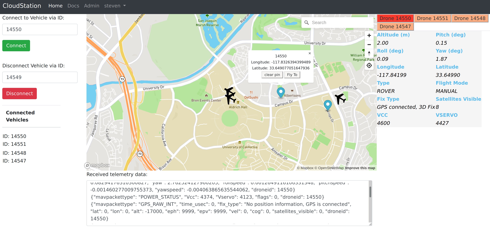
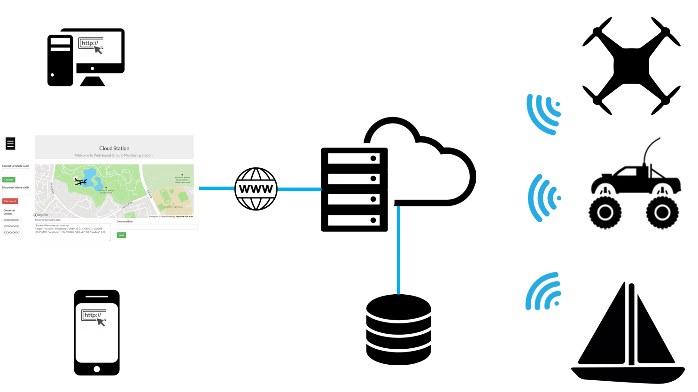

# Web-based Ground Control Station
[](https://github.com/lyuyangh/cloud-station/blob/master/LICENSE)  
The goal of this project is to develop a cloud-based ground control station for Ardupilot drones. The web app is designed to be easily scalable so users can control multiple drones at the same time.   
> The project is still under development and we would love to have more developers joining us!  

**Websites**  
> [CloudStation Dashboard](http://ec2-52-52-195-170.us-west-1.compute.amazonaws.com/)    
> [Deployment instructions](https://github.com/CloudStationTeam/cloud_station_deployment)  
> [Docs](https://cloud-station-docs.readthedocs.io/en/latest/)

**System architecture**:

  


## Prerequisite 
```
Python 3.6+
Django
Django Channels
Django Background Tasks
Redis
pyMavlink
pyserial
Docker
```
> Tutorial to setup Python Django development environment: https://developer.mozilla.org/en-US/docs/Learn/Server-side/Django/development_environment

## Getting started
**These steps can be used to set up a local development environment for this web app. Please follow deployment instructions instead if you want to deploy it on a web server.**
  1. Install libraries    
      ```
      pip3 install -r requirements.txt  
      ```
  2. Install and run docker: https://www.docker.com/get-started
      ```  
      docker run -p 6379:6379 -d redis:2.8
      ```
  3. Register for MapBox and generate a public access token https://account.mapbox.com/
  4. Add mapbox public access token (public key) to .env of your environment
    Note: Please do not push your pk to GitHub. In production env, this key should ideally
    be temporary and change from session to session.      
        * ubuntu   
        ```export MAPBOX_PUBLIC_KEY=pk.xxxxxxxxxxxxxxxxxxxxxxxxxx```     
        * windows  
        ```setx MAPBOX_PUBLIC_KEY "pk.xxxxxxxxxxxxxxxxxxxxxxxxxxxxx"``` or add an entry in system variables
        
### Run server
```
python3 manage.py makemigrations
python3 manage.py migrate
python3 manage.py runserver
python3 manage.py process_tasks
```
## Architecture
## Milestones & Backlogs
- [x] System architecture and prototype (8/31/19)
- [x] Rewrite mavlink streaming code (9/5/19)
- [x] Add map to html (10/15/19)
- [x] Deploy on AWS (10/15/19) We are online!!!
- [x] Build hardware stack with Omnibus F4 and Raspberry Pi (10/30/19)
- [x] Two way communication between vehicle and the server (11/5/19)
- [x] User authentication (11/16/19)
- [x] Mark drone location on map (11/24)
- [X] Migrate to AWS RDS
- [ ] Communicate with multiple drones at the same time
- [ ] Distinguish different users. Only send vehicle updates to authorized users.
- [ ] Develop an improved UI for telemetry data.
- [ ] Use a more robust background tasks solution.

## Authors
  * Lyuyang Hu - Software architecture design, prototyping, project management, backend development
  * Mina Bedwany - Front-end, back-end development
  * Omkar Pathak - Infrastructure development
  * 
  * 
  * 
## Advisor
  * Professor Peter Burke
## License
GNU General Public License v3.0